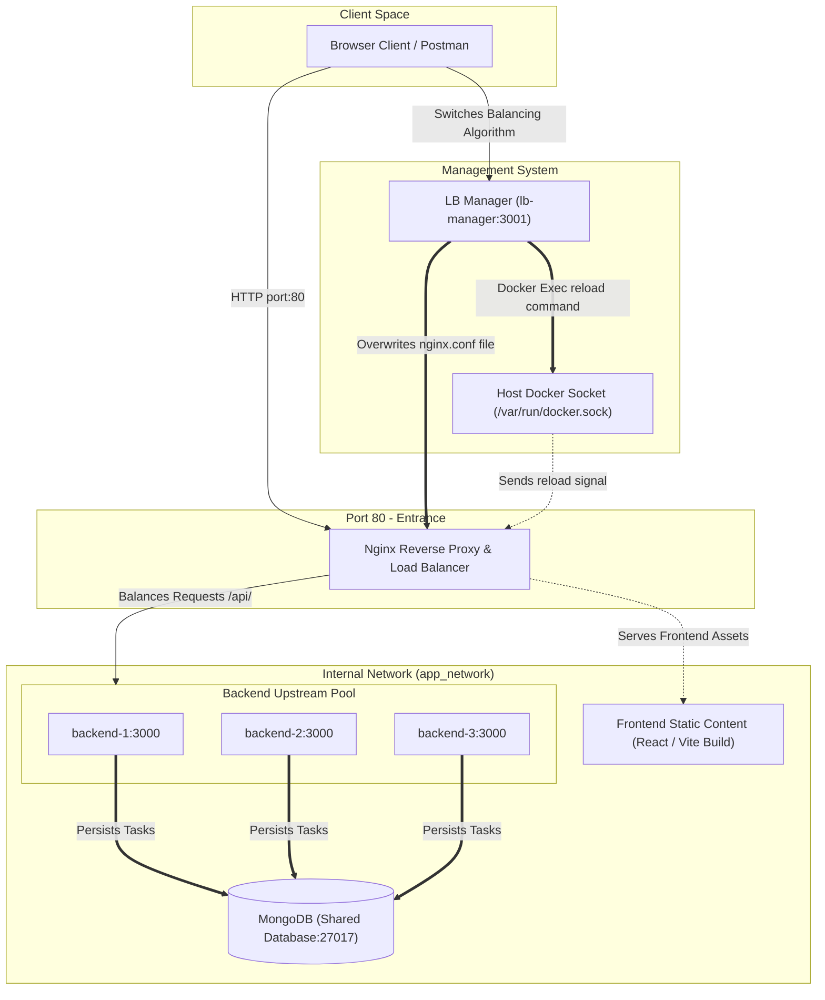

# Nginx Dynamic Load Balancer & Task Manager Dashboard

A high-performance, horizontally scalable web application demonstrating **Nginx Load Balancing** with dynamic runtime algorithm switching, container health checking, and distributed state management.

---

## Architecture Overview

The system operates as a microservices cluster orchestrated by Docker Compose:

1. **Client Space (Browser / Postman)**: Initiates HTTP requests to the cluster entrypoint on port `80`, or uses the API management interface on port `3001`.
2. **Nginx Load Balancer (Port 80)**: Serves the compiled React frontend static files and acts as a reverse proxy that routes incoming API requests (`/api/*`) across three identical Node.js Express backend instances.
3. **Backend Services (backend-1, backend-2, backend-3)**: Node.js worker nodes listening on port `3000` (internal network). They flag requests with their specific hostname to demonstrate active traffic distribution.
4. **Shared Database (mongo)**: A MongoDB database container serving as the persistent shared state for all backend tasks.
5. **Load Balancer Manager (lb-manager on Port 3001)**: An administration service that rewrites `nginx.conf` and reloads Nginx inside its container dynamically using Docker sockets when the user requests an algorithm change.

---

## Architecture Diagram

Here is a visual overview of request routing, database synchronization, and dynamic configuration reloading:



---

## Project Structure

```
4.Load-Balance-Project/
├── backend/                  # Node.js Express task API service
│   ├── models/               # Mongoose schemas (Task.js)
│   ├── Dockerfile            # Production Node image builder
│   ├── server.js             # API server logic (routes & mongo connection)
│   └── package.json
│
├── frontend/                 # React client dashboard (Vite + CSS)
│   ├── src/
│   │   ├── assets/           # UI static assets
│   │   ├── App.css           # Glassmorphic layout styling (custom CSS)
│   │   ├── App.jsx           # Task manager dashboard page & switcher UI
│   │   ├── index.css         # Typography and root design variables
│   │   └── main.jsx          # React app entry mountpoint
│   ├── Dockerfile            # Multi-stage frontend compilation image
│   ├── index.html            # Main HTML wrapper
│   └── vite.config.js        # Vite build & proxy settings
│
├── management/               # LB Manager administration microservice
│   ├── Dockerfile            # Node image with Docker access configuration
│   ├── server.js             # Algorithm switcher endpoints & Nginx reloader
│   └── package.json
│
├── nginx/                    # Nginx configuration template scripts
│   ├── architecture.mermaid  # Raw diagram source file
│   ├── nginx.conf            # Active Nginx configuration (writable)
│   ├── nginx-roundrobin.conf # Backup configuration template
│   ├── nginx-leastconn.conf  # Backup configuration template
│   ├── nginx-iphash.conf     # Backup configuration template
│   └── nginx-weighted.conf   # Backup configuration template
│
├── postman/                  # Postman collection & environment tests
│   ├── load_balancer.postman_collection.json
│   └── load_balancer.postman_environment.json
│
└── docker-compose.yml        # Main Docker orchestration file
```

---

## Port Mapping Summary

| Service | Host Port | Container Port | Purpose |
| :--- | :--- | :--- | :--- |
| **nginx** | `80` | `80` | Client entrance. Serves React dashboard & routes requests to `/api/` |
| **lb-manager** | `3001` | `3000` | Administrative backend used to switch load balancing configurations |
| **backend-1** | *None* | `3000` | Cluster worker node 1 (Internal network only) |
| **backend-2** | *None* | `3000` | Cluster worker node 2 (Internal network only) |
| **backend-3** | *None* | `3000` | Cluster worker node 3 (Internal network only) |
| **mongo** | *None* | `27017` | Cluster database instance (Internal network only) |

---

## Load Balancing Algorithms

Nginx supports multiple ways of sharing traffic load across backends:

### 1. **Round Robin (Default)**
Distributes incoming requests sequentially down the list of backend servers. Good for identical server specifications.
```nginx
upstream task_backend {
    server backend-1:3000;
    server backend-2:3000;
    server backend-3:3000;
}
```

### 2. **Least Connections (`least_conn`)**
Routes the next request to the backend node that currently has the fewest active HTTP connections. Ideal for requests that vary in completion times.
```nginx
upstream task_backend {
    least_conn;
    server backend-1:3000;
    server backend-2:3000;
    server backend-3:3000;
}
```

### 3. **IP Hash (`ip_hash`)**
Uses the client's IP address as a hash key to determine which backend server should receive the request. Ensures session persistence (sticky sessions) where the same client always communicates with the same backend node.
```nginx
upstream task_backend {
    ip_hash;
    server backend-1:3000;
    server backend-2:3000;
    server backend-3:3000;
}
```

### 4. **Weighted Round Robin (`weight=X`)**
Configures capacity weight to each backend instance. Backends with higher weights handle more traffic. Useful when some server machines are physically more powerful than others.
```nginx
upstream task_backend {
    server backend-1:3000 weight=3;
    server backend-2:3000 weight=1;
    server backend-3:3000 weight=1;
}
```

---

## Quick Start & Operation

### 1. Build and Launch the Cluster
Navigate to the project directory and start the Docker services:
```bash
docker compose up --build -d
```

### 2. Access the Dashboard
Open your browser and navigate to:
* **Task Manager Dashboard**: `http://localhost/`
* You can test adding tasks, deleting them, and clicking the algorithm buttons to switch between load-balancing mechanisms in real-time.

---

## Testing with Postman

We have included a Postman testing suite inside the `postman/` directory to automate API validation and load balancing health check requests.

### Steps to Import and Use:
1. Open **Postman**.
2. Click the **Import** button in the top left corner.
3. Drag and drop the following files from this project:
   * [load_balancer.postman_collection.json](file:///d:/devops-labs/ngnix-lab/4.Load-Balance-Project/postman/load_balancer.postman_collection.json)
   * [load_balancer.postman_environment.json](file:///d:/devops-labs/ngnix-lab/4.Load-Balance-Project/postman/load_balancer.postman_environment.json)
4. Set your active environment to **Nginx Load Balancer Environment** (top right dropdown).
5. Run requests in the **Task API** folder to read and add tasks, or use the **Management API** folder to change Nginx balancing algorithms at runtime.
6. Check the **Tests** tab and **Postman Console** logs to inspect which specific backend hostname served your requests.
