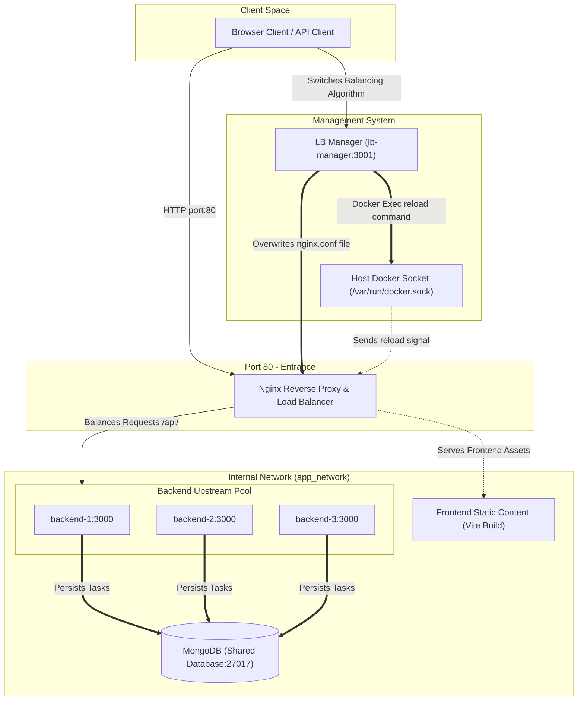
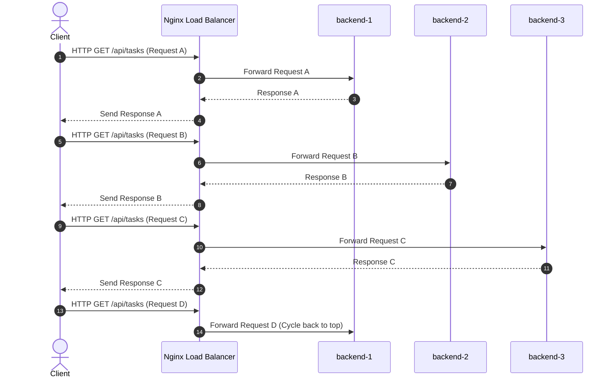
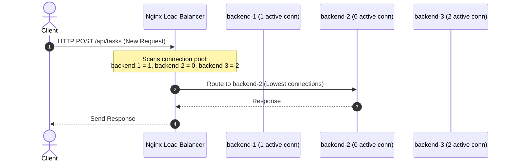
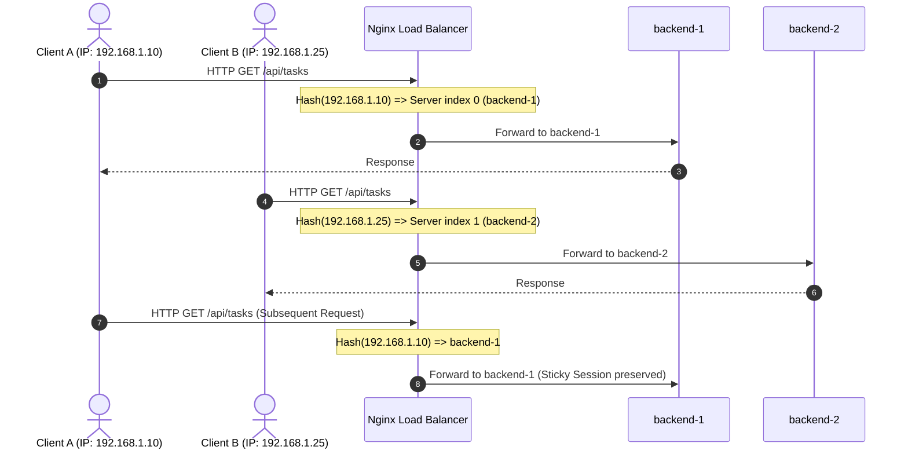
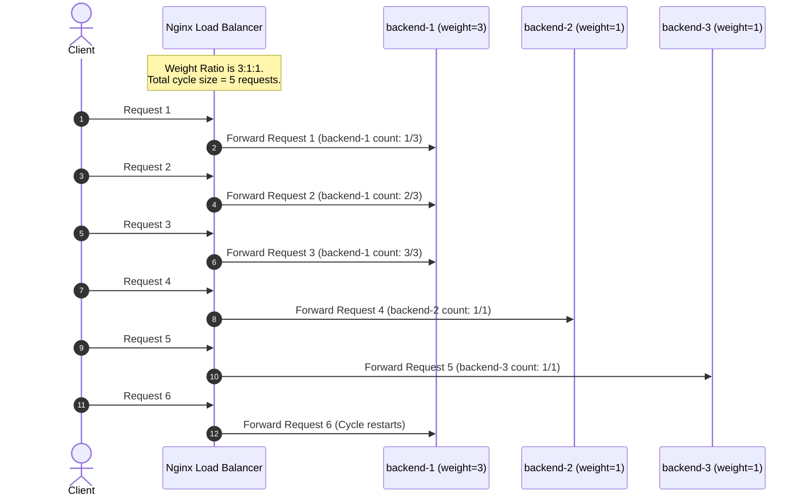

# Nginx Load Balancing Algorithms Report

This report provides a detailed, in-depth analysis of the Nginx load-balancing architecture, the configuration templates found in the project, and the specific balancing algorithms implemented.

---

## Architecture Overview

The project uses a structured multi-container microservice layout where Nginx sits at the entrance of the internal application network.

### System Components
1. **Entrance Proxy (Nginx)**: Listens on port 80. It serves compiled React client files directly and proxies API calls (`/api/`) to the backend upstream block.
2. **Backend Services (backend-1, backend-2, backend-3)**: Three distinct Express applications running on port 3000 inside the internal virtual network.
3. **Database (MongoDB)**: Used for shared state storage.
4. **Management API (lb-manager)**: Listens on port 3001. It dynamically updates Nginx configurations and commands a hot reload.

### System Routing Diagram

The following Mermaid diagram outlines the general request pathways, network boundaries, and administrative commands:



---

## Detailed Load Balancing Algorithms Analysis

Nginx distributes incoming traffic across the backend pool using the configured upstream block. Below is an in-depth breakdown of the four algorithms implemented in this project.

### 1. Round Robin (Default)

#### Concepts and Theory
Round Robin is the default balancing algorithm in Nginx. It requires no explicit algorithm keyword inside the upstream block. Nginx routes incoming requests sequentially down the list of backend servers, cycling back to the top once it reaches the end.

#### Upstream Configuration
```nginx
upstream task_backend {
    server backend-1:3000;
    server backend-2:3000;
    server backend-3:3000;
}
```

#### Request Routing Flow


#### Assessment
* **Pros**: Simple to configure, no processing overhead, guarantees even distribution when request workloads and server capacities are identical.
* **Cons**: Fails to consider server load, processing capability, or memory consumption. A slow or overloaded backend server will still receive the same number of requests as idle, high-capacity servers.
* **Best Use Cases**: Stateless microservices clusters where all backend servers have equal hardware specifications and tasks require similar processing times.

---

### 2. Least Connections

#### Concepts and Theory
The Least Connections algorithm routes the next incoming request to the backend server with the lowest number of active connections. This is configured using the `least_conn` directive inside the upstream block. Nginx monitors active TCP handshakes to make real-time decisions.

#### Upstream Configuration
```nginx
upstream task_backend {
    least_conn;
    server backend-1:3000;
    server backend-2:3000;
    server backend-3:3000;
}
```

#### Request Routing Flow


#### Assessment
* **Pros**: Highly dynamic and adaptive. Prevents backend overload by avoiding servers currently busy handling long-running transactions.
* **Cons**: Slightly higher memory/CPU overhead on the load balancer to track active connections. Can lead to "thundering herd" issues if a newly started server immediately receives a flood of requests because its connection count is zero.
* **Best Use Cases**: Applications with heterogeneous requests (e.g., some requests finish in 10ms, while others require file uploads/downloads or heavy database reports taking seconds).

---

### 3. IP Hash

#### Concepts and Theory
IP Hash uses the client's IPv4 address (or IPv6 address) as a hash key to determine the backend server to receive the request. This is configured using the `ip_hash` directive. The hash calculation maps a client's IP to one of the servers in the pool, ensuring session persistence (sticky sessions).

#### Upstream Configuration
```nginx
upstream task_backend {
    ip_hash;
    server backend-1:3000;
    server backend-2:3000;
    server backend-3:3000;
}
```

#### Request Routing Flow


#### Assessment
* **Pros**: Simplifies backend design by enabling stateful behaviors (e.g., local server-side caches, session storage) without requiring central state stores like Redis.
* **Cons**: Can lead to uneven load distribution if many users share an egress NAT gateway (meaning they present the same external IP to Nginx) or if a high-traffic client gets hashed to a single backend node.
* **Best Use Cases**: Legacy applications requiring session stickiness where migrating to stateless session databases is not feasible.

---

### 4. Weighted Round Robin

#### Concepts and Theory
Weighted Round Robin configures explicit capacity levels to upstream servers using the `weight=X` parameter. Nginx distributes requests based on the ratio of configured weights. A server with a weight of 3 receives three times more requests than a server with a weight of 1.

#### Upstream Configuration
```nginx
upstream task_backend {
    server backend-1:3000 weight=3;
    server backend-2:3000 weight=1;
    server backend-3:3000 weight=1;
}
```

#### Request Routing Flow


#### Assessment
* **Pros**: Allows systems administrators to maximize hardware usage in heterogeneous server rooms. Prevents weaker hardware from collapsing under high load.
* **Cons**: Static capacity configuration. Does not adapt to dynamic virtual machine resizing or transient performance degradation on physical hosts.
* **Best Use Cases**: Bare-metal or cloud hosting setups where worker instances run on varying server classes (e.g., combining a 16-core server with 4-core servers in the same cluster).

---

## Algorithm Comparison Summary Matrix

| Metric | Round Robin | Least Connections | IP Hash | Weighted Round Robin |
| :--- | :--- | :--- | :--- | :--- |
| **Statefulness** | Stateless | Stateless | Sticky (Persistent) | Stateless |
| **Considers Capacity** | No | No | No | Yes (Explicitly configured) |
| **Considers Live Load** | No | Yes | No | No |
| **Distribution Balance** | Equal | Adaptively Balanced | Potentially Unequal | Proportional to Weight |
| **Complexity** | Extremely Low | Low | Medium | Low |

---

## Dynamic Configuration & Runtime Reloading

A key capability of the architecture is changing the load balancing algorithm at runtime without dropping active client connections.

### Runtime Configuration Reload Mechanics
1. **Configuration Overwrite**: The `lb-manager` service processes an API request to switch the algorithm, matches it with the Javascript templates, and overwrites `/nginx-config/nginx.conf`.
2. **Docker Signal Dispatch**: Using the mounted docker socket, the `lb-manager` makes an API call to the Docker daemon equivalent to `docker exec nginx nginx -s reload`.
3. **Master Process Interception**: The Nginx master process receives the reload signal (`SIGHUP`), validates the syntax of the new `nginx.conf`, and starts new worker processes running the new configuration.
4. **Graceful Connection Handover**: Old worker processes cease accepting new connections and continue handling current active requests. Once all legacy connections finish, the old workers exit gracefully.

This mechanism ensures zero downtime and seamless transitions between algorithms.
